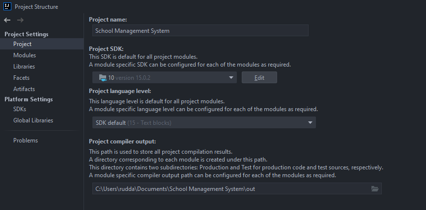
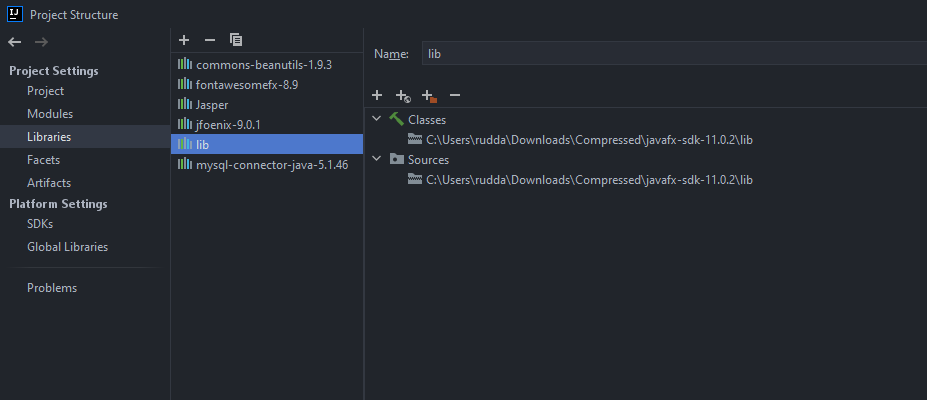
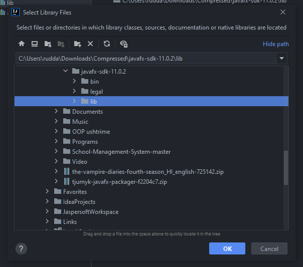
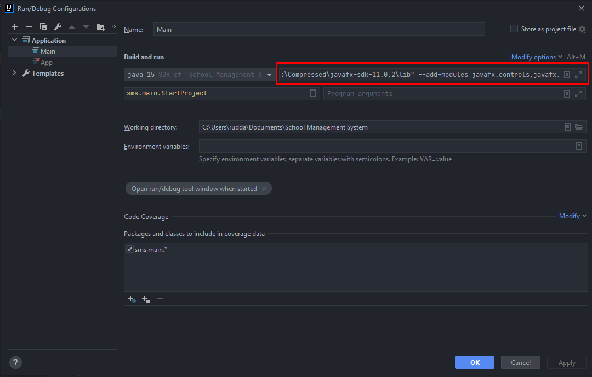

# School Management System

## Projekti:
Krijimi i një aplikacioni që është sistemi i menaxhimit të shkollës përmes të cilit mund të kemi qasje në llogarit tona specifike.

## Kërkesat e projektit:
Projekti duhet të përmbaj: emrin e përdoruesit dhe fjalkalimin. Pas kyqjes në aplikacion mund të bëjmë menaxhimin e llogarive të përdoruesve, poashtu mund të bëjmë kontrollimin e studentëve (insertimi, fshirja dhe përditësimi), shkollës apo stafit të shkollës.

## Dependencies:
Për të pasur mundësi të lëshimit të aplikacionit duhet që të importohet JavaFX në aplikacionin tuaj.
<br>
#### Importimi i JavaFX:
* Shkojmë te faqja zyrtare e [JavaFX](https://openjfx.io/) dhe shkarkojmë versionin e findit të JavaFX SDK.
* Tek folderi që sapo morrëm gjejmë nënfolderin ___lib___, na nevojitet ky folder sepse është
libraria që përmban modulet e nevojshme për një JavaFX aplikacion.
* _Për krijimin e aplikacionit kemi përdorur IntelliJ Idea por hapat e importimit të moduleve janë të ngjashme edhe në IDE të tjera._
    * Shkoni tek `File -> Project Structure -> Project` dhe vendosni SDK e projektit në 15 (JavaFX SDK v15 është versioni i fundit)<br><br>
    
      <br><br>
    * Importojmë librarin:
        * `File -> Project Structure -> Libraries` Shtojmë JavaFX SDK 15 si librari në projekt
        <br><br>
        
        <br><br>
        
        <br><br>
        Menjëherë pas importimit klasat e JavaFX do të njihen nga IDE.
          <br><br>
    * Nëse provojmë të bëjmë run programin tani do të paraqitet gabimi:
      ```
      Caused by: java.lang.RuntimeException: Exception in Application start method
      at javafx.graphics/com.sun.javafx.application.LauncherImpl.launchApplication1(LauncherImpl.java:900)
      ...
      Caused by: java.lang.IllegalAccessError: class com.sun.javafx.fxml.FXMLLoaderHelper (in unnamed module @0xXXXXX) cannot access class com.sun.javafx.util.Utils (in module javafx.graphics) because module javafx.graphics does not export com.sun.javafx.util to unnamed module @0xXXXXX
      ...
      ```
      Për ti zgjidhur këto probleme duhet të bëhet konfigurimi i makinës virtuale:
      * `Run -> Edit Configurations -> Modify Options -> Add VM Options` dhe shtojmë këto konfigurime:
        <br><br>
        _Për makinat Linux/MAC:_
        <br>
        `--module-path /path/to/javafx-sdk-15.0.1/lib --add-modules javafx.controls,javafx.fxml`
        <br><br>
        _Për makinat Windows_
        <br>
        `--module-path "\path\to\javafx-sdk-15.0.1\lib" --add-modules javafx.controls,javafx.fxml
        `
      <br><br>
       
<br><br>
  
<br>
Pasi që projekti është i lidhur me databaza SQL atëherë nevojitet që të importohet libraria që bën të mundur komunikimin
e aplikacionit me databaza të MySQL.
<br>
<hr>
<br>

## Kodi
### Java:
##### Ndezja e serverit MySQL
```Java
import java.sql.*;


public class DBConnection {
    private Connection connection;
    private static DBConnection dbConnection;

    private DBConnection()throws ClassNotFoundException,SQLException {
        Class.forName("com.mysql.jdbc.Driver");
        connection=DriverManager.getConnection("jdbc:mysql://localhost/schoolmanagementsystem","root","");
    }
    public Connection getConnection() {
        return connection;
    }
    public static DBConnection getDBConnection()throws ClassNotFoundException,SQLException{
        if(dbConnection==null) {
            dbConnection=new DBConnection();
        }
        return dbConnection;
    }
}
```
##### Lëshimi i programit
```Java
public class StartProject extends Application {

    /**
     * This method start the applicaion by starting the preloader
     * @param primaryStage
     * @throws Exception
     */
    @Override
    public void start(Stage primaryStage) throws Exception{
        Parent root = FXMLLoader.load(getClass().getResource("/sms/view/fxml/SplashScreen.fxml"));
        primaryStage.setTitle("School Management System");
        primaryStage.setScene(new Scene(root));
        primaryStage.setResizable(false);
        primaryStage.initStyle(StageStyle.UNDECORATED);
        primaryStage.getIcons().add(new Image(getClass().getResourceAsStream("/sms/other/img/up-logo.png")));
        primaryStage.show();
    }

    /**
     * Main method
     * @param args
     */
    public static void main(String[] args) {
        launch(args);
    }
}
```
Klasa `StartProject` bënë vetëm lëshimin e një preloaderi i cili pastaj bënë lëshimin e gjithë programit
<br><br>
Klasa e preloaderit
```Java
public class SplashScreenController implements Initializable {
    @FXML
    private AnchorPane rootPane;

    /**
     * Initialize Resources
     * @param url
     * @param rb
     */
    @Override
    public void initialize(URL url, ResourceBundle rb) {
        new SplashScreen().start();
    }

    /**
     * Special class to get the preloader
     */
    class SplashScreen extends Thread {
        public void run() {
            try {
                Thread.sleep(3000);

                Platform.runLater(new Runnable() {
                    @Override
                    public void run() {
                        Parent root = null;
                        try {
                            root = FXMLLoader.load(getClass().getResource("/sms/view/fxml/login.fxml"));
                        }
                        catch (IOException ex) {
                            Logger.getLogger(SplashScreenController.class.getName()).log(Level.SEVERE, null, ex);
                        }
                        Scene scene = new Scene(root);
                        Stage stage = new Stage();
                        stage.setTitle("School Management System");
                        stage.getIcons().add(new Image(getClass().getResourceAsStream("/sms/other/img/up-logo.png")));

                        stage.setResizable(false);
                        stage.setScene(scene);
                        stage.show();

                        rootPane.getScene().getWindow().hide();
                    }
                });
            }
            catch (InterruptedException ex) {
                Logger.getLogger(SplashScreenController.class.getName()).log(Level.SEVERE, null, ex);
            }
        }
    }
}
```

